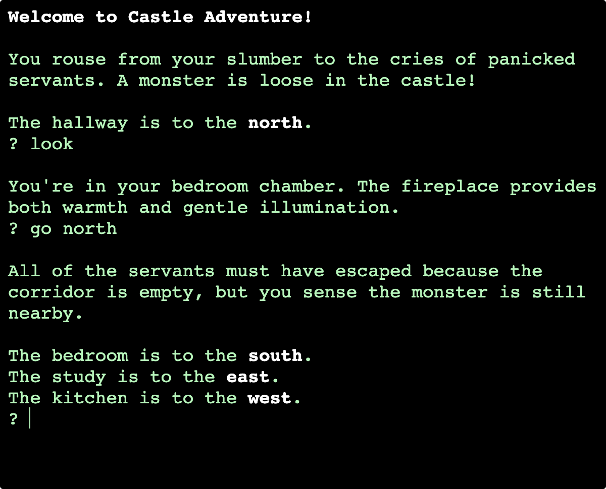

# Castle Adventure

This repository is part of a Thing-a-Week challenge. This week’s theme is:

> A thing that takes input and generates output in a different medium (text
to speech, picture to sound, speech to art, etc.) 

A small text adventure game in which you must defeat the monster
terrorizing the castle. Speech recognition is used to receive input while
output is read aloud using text-to-speech.

The game understands the following verbs:

  * `look`
  * `go <direction>` / `move <direction>`
  * `take <object>`
  * `use <object>`

**Note:** The [Web Speech API](https://developer.mozilla.org/en-US/docs/Web/API/Web_Speech_API/Using_the_Web_Speech_API)
is still experimental and [is not available in all browsers](https://caniuse.com/?search=SpeechRecognition).

**Demo:** [tboronczyk.github.io/taw-altoutput/src/index.html](https://tboronczyk.github.io/taw-altoutput/src/index.html)

---

